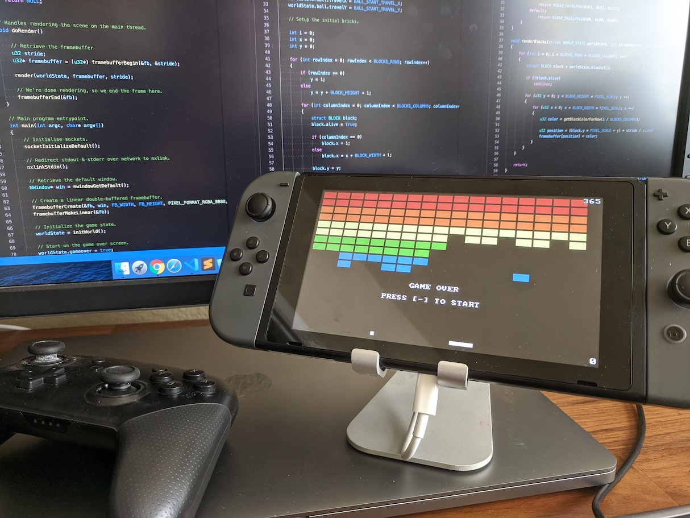

# Breakout for Nintendo Switch

This is a very simple version of Breakout written in C using [`libnx`](https://github.com/switchbrew/libnx) for the Nintendo Switch. This was a quick learning exercise to get acquainted with developing homebrew software on Nintendo's Switch game console.



## Compiling and Running

You'll need a Nintendo Switch game console capable of running homebrew software. See the following links for more details:

* [NH Switch Guide](https://nh-server.github.io/switch-guide/)
* [Homebrew Guide](https://switch.homebrew.guide/index)
  * [Introduction to Homebrew development](https://switch.homebrew.guide/homebrew_dev/introduction)

First, install `devkitPro`, `devkitA64`, and the `switch-dev` package (see above links) and then clone and build the source:

```
git clone git@github.com:Justin-Credible/switch-breakout.git
cd switch-breakout
make
```

This will build a `switch-breakout.nro` file (among others) which can be copied to `sd:/switch/` and launched via hbmenu.

Additionally, the `nro` can be loaded over the network using hbmenu's NetLoader functionality. This allows `stdout` to be shown on your computer. Start NetLoader on the Switch and then run:

```
nxlink -s switch-breakout.nro
```
